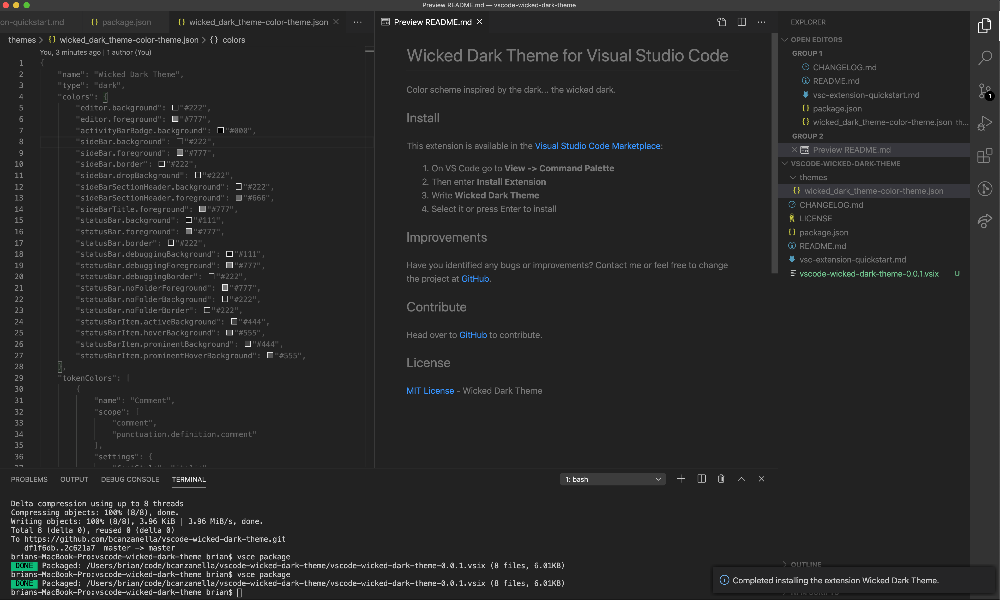

# Wicked Dark Theme for Visual Studio Code

Color scheme inspired by the dark... the wicked dark.

## Install

This extension is available in the [Visual Studio Code Marketplace](https://marketplace.visualstudio.com/items?itemName=bcanzanella.vscode-wicked-dark-theme):
1. On VS Code go to **View -> Command Palette**
2. Then enter **Install Extension**
3. Type **Wicked Dark**
4. Select it or press Enter to install

## Improvements

Have you identified any bugs or improvements? Contact me or feel free to change the project at [GitHub](https://github.com/bcanzanella/vscode-wicked-dark-theme).

## Contribute
Head over to [GitHub](https://github.com/bcanzanella/vscode-wicked-dark-theme) to contribute.

## License

[MIT License](./LICENSE) - Wicked Dark Theme
